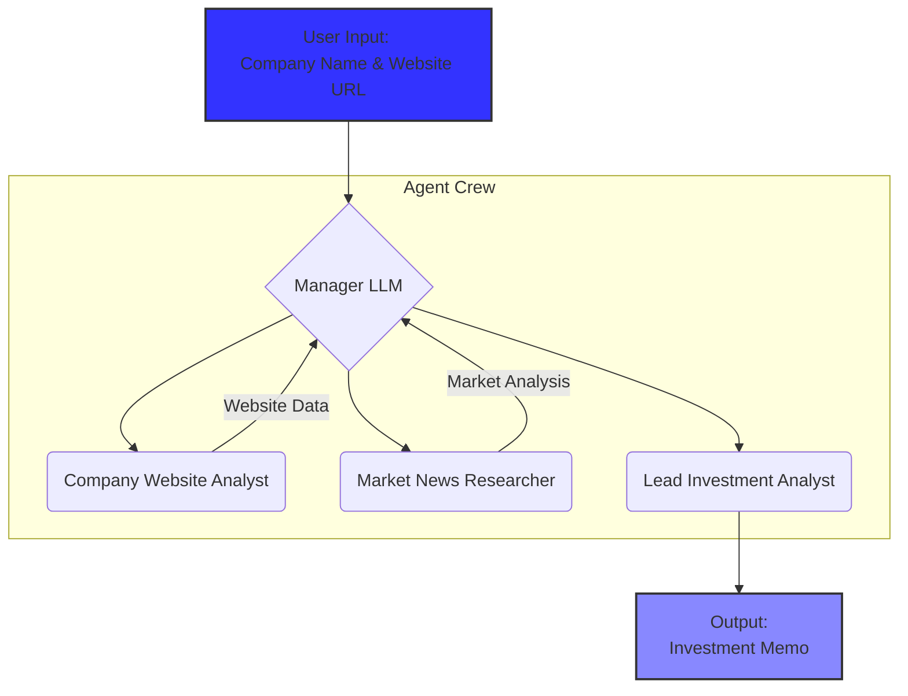

# M&A Analysis Multi-Agent System

## Project Overview

This project implements a multi-agent AI system using the `crewai` framework to perform detailed analysis on a company for potential mergers and acquisitions (M&A). The system takes a company's name and website URL as input, and generates a comprehensive investment memo.

The multi-agent crew consists of three specialized agents working together under the supervision of a manager LLM in a hierarchical process:

1.  **Company Website Analyst**: This agent is responsible for scraping the target company's website to extract key information such as its value proposition, target audience, products, and services.
2.  **Market News Researcher**: This agent scours the web for recent news, press mentions, and other public signals related to the company. It also identifies the company's main competitors.
3.  **Lead Investment Analyst**: This agent synthesizes the information gathered by the other two agents into a structured investment memo, providing a final recommendation and a confidence score.

## Architecture Diagram

The workflow is managed hierarchically, allowing a manager LLM to orchestrate the agents and the flow of information to produce the final investment memo.



## Setup and Installation

1.  **Clone the repository:**
    ```bash
    git clone <repository-url>
    cd m-a-agent
    ```

2.  **Install dependencies:**
    Make sure you have Python 3.8+ installed.
    ```bash
    pip install -r requirements.txt
    ```

3.  **Set up API Keys:**
    Create a `.env` file in the `m-a-agent` directory and add your API keys:
    ```
    OPENAI_API_KEY="sk-..."
    SERPER_API_KEY="..."
    ```
    You need an API key from [OpenAI](https://openai.com) and [Serper](https://serper.dev) for the web search capabilities.

4.  **Run the application:**
    ```bash
    python main.py
    ```
    The application will prompt you to enter the company name and website URL in the console.

## Design Choices & Trade-offs

*   **Process Model**: I chose a `hierarchical` process over a `sequential` one. This allows a `manager_llm` (`gpt-4o`) to intelligently delegate tasks and manage the flow of information between agents. This is more robust than a simple sequential pipeline, as the manager can ensure the final analyst gets all the necessary context from both the website scraping and market research before starting its work.

*   **Agent Specialization**: The agents have distinct roles and tools (`ScrapeWebsiteTool` for the website analyst, `SerperDevTool` for the market researcher). This separation of concerns makes the system more modular and easier to debug or extend. The `LeadInvestmentAnalyst` has no tools and focuses solely on synthesizing the provided data, preventing it from fetching new, potentially conflicting information.

*   **LLM Selection**: The project uses `gpt-4` for the analysis agents (`CompanyWebsiteAnalyst` and `MarketNewsResearcher`) to leverage its strong reasoning capabilities for extracting and summarizing information. For the final synthesis task, `o3-mini` is used for the `LeadInvestmentAnalyst`. This could be a cost-saving measure, as the final memo generation is more of a structured formatting task based on provided context, which a smaller model can handle effectively.

*   **Limitations & Improvements**:
    *   The `ScrapeWebsiteTool` is effective for static websites but may fail to extract information from heavily JavaScript-rendered or single-page applications (SPAs). To improve this, the system could be upgraded to use more advanced scraping tools like Selenium or Playwright, which can render JavaScript.
    *   The market analysis is limited to what the `SerperDevTool` can find. It doesn't include analysis of financial statements (e.g., from SEC filings), which is a critical part of M&A analysis. A future improvement would be to add a new agent specialized in financial analysis, equipped with tools to access and parse financial documents.
    *   The analysis is currently limited to English-language sources.

## Example Prompts

Here are the prompts that define the behavior of each agent and task in the system.

### Agent Prompts

**1. CompanyWebsiteAnalyst**
*   **Role**: `Senior Company Analyst`
*   **Goal**: `Extract {company}'s value proposition, target audience, key products and services, and unique selling proposition.]`
*   **Backstory**: `You are a senior analyst specializing in company analysis. you're detail oriented and focused on extracting the most relevant information from the company's website.`

**2. MarketNewsResearcher**
*   **Role**: `Market News Researcher`
*   **Goal**: `To find credible and up-to-date external information about a given company based on the input provided by the Senior Company Analyst. This includes summarizing recent news articles, public signals, or press mentions, and identifying 1-2 direct competitors based on the companys product and market.`
*   **Backstory**: `You are a highly skilled Market News Researcher working in a venture capital firm. Your mission is to assist investment analysts by gathering the most relevant and recent external data about startups under evaluation. You specialize in finding news articles, funding rounds, market trends, and identifying key competitors using web search tools like Serper. You do not make assumptions or speculate. Your reports must be concise, accurate, and verifiable.`

**3. LeadInvestmentAnalyst**
*   **Role**: `Lead Investment Analyst`
*   **Goal**: `Synthesize a structured Investment Memo based on information from Senior Company Analyst and Market News Researcher.`
*   **Backstory**: `You are a senior investment analyst at a venture capital firm. You are known for your analytical clarity and objective decision-making. You receive preprocessed research from two junior analysts: one who studied the company's website, and another who researched the market landscape. Based on these findings, you deliver final investment recommendations in a standardized format.`

### Task Prompts

**1. scrape_website_task**
*   **Description**: `Scrape {company}'s website {website_url} for the company's value proposition, target audience, key products and services, and unique selling proposition.`
*   **Expected Output**: `Your goal is to extract the following structured data from the company website content: 1. Value Proposition - What is the company trying to solve or offer? 2. Target Customer - Who is their product aimed at? 3. Key Product Features - What are the main product features mentioned?`

**2. market_news_task**
*   **Description**: `You are tasked with performing detailed market research for a given company. Your job is to: Search the web for: - Recent news, announcements, or press coverage about the company (e.g., product launches, funding rounds, partnerships, controversies). - Identify and list 1-2 direct competitors offering similar products or targeting similar customers. How to proceed: - Use only credible sources. - Prioritize recent results (within the last 6 months). - Do NOT invent or speculate. If a certain piece of data isn't found, clearly say so.`
*   **Expected Output**: `Your goal is to analyze the market and make a precise summary of {company}'s current standing in the market and top 2 competitors.`

**3. memo_synthesis_task**
*   **Description**: `Your task is to create a structured investment memo about {company} based of the information you recieved from Senior Company Analyst and Market News Researcher. Guidelines: - Be objective and concise. - Highlight market opportunity, product strength, and possible risks. - Do not make up information — only base your judgment on the provided structured inputs.`
*   **Expected Output**: `A detailed Investment Memo with all the company details like Value Proposition, Target Customer, Key Product Features news_summary, competitors and final verdict on Investing in the company with a confidence rating between 1-10, 1 is lowest, while 10 is highest`
